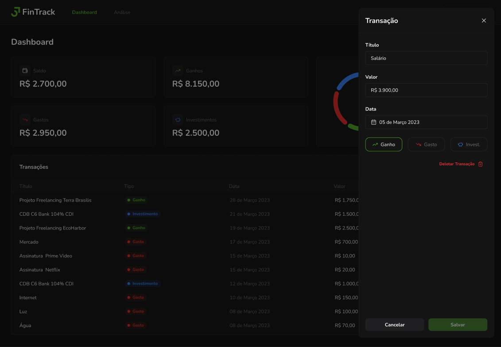

### Projeto ReactJS 18


### Telas do projeto




* criando o projeto
```
npm create vite@6.1.1
```

* Selecionar React JS

* prettier
```
npm i -D prettier@3.4.2
```

* criar um arquivo .prettierrc.json
```
{
    "trailingComma": "es5",
    "tabWidth": 4,
    "semi": false,
    "singleQuote": true
}
```

* evitar conflitor com eslint
```
npm i -D eslint-config-prettier@10.0.1
```

* organiza importes
```
npm i -D eslint-plugin-simple-import-sort@12.1.1
```

#### Tailwind CSS

```
npm i -D tailwindcss@3.4.17 postcss@8.4.49 autoprefixer@10.4.20
```

```
npx tailwindcss init -p
```

```tailwind.config.js
/** @type {import('tailwindcss').Config} */
export default {
  content: ['./index.html', './src/**/*.{js,ts,jsx,tsx}'],
  theme: {
    extend: {},
  },
  plugins: [],
}
```

```index.css
@tailwind base;
@tailwind components;
@tailwind utilities;
```